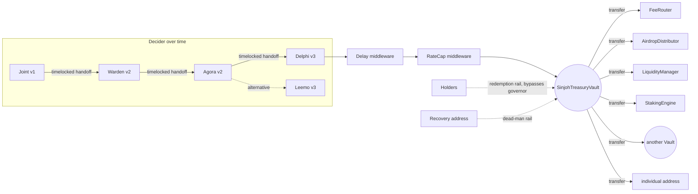

# SinjohTreasuryVault — Design Map (Rev 2)

Companion to [TREASURY_BRAINSTORM.md](./TREASURY_BRAINSTORM.md). Design only, no code.
Rev 2 incorporates the red-team findings in
[TREASURY_DESIGN_CHALLENGE.md](./TREASURY_DESIGN_CHALLENGE.md): rails moved out of
the kernel into middleware, a kernel redemption rail added as the only hard
holder-facing guarantee, a governor-deadlock escape added, the allowlist redesigned,
and safer reference defaults.

Reflects the agreed model: standalone immutable protocols, one governor slot,
pluggable governance modules (Joint v1 → Warden/Agora v2 → Delphi/Leemo v3).

---

## 1. The one design rule

**The vault is the dumbest contract in the system.** It custodies assets, obeys one
address (the governor), and does nothing else. Every current and future capability
lives in one of four places outside the kernel:

| Direction | What plugs in | Examples |
|---|---|---|
| **Upstream — deciders** | Governor modules holding (directly or through middleware) the governor slot | Joint, Warden, Agora, Delphi, Leemo, a Safe, an EOA |
| **Upstream — middleware rails** | Immutable policy contracts chained between decider and vault | Delay, RateCap, Allowlist, Pause |
| **Downstream — sinks** | Protocols that receive plain transfers | FeeRouter, AirdropDistributor, LiquidityManager, StakingEngine, future BuybackEngine / Streamer / YieldAdapter / committed-reserve vaults |
| **In-kernel — holder rails** (the only exceptions to dumbness) | Guarantees that must survive any governor, elected at deploy | Redemption rail, dead-man recovery rail |

Because the governor slot is *just an address that may instruct transfers*, any
governance technology that exists now or is invented later qualifies without the
vault ever knowing the difference. **The vault's interface is so small it cannot go
out of date.**

One correction to the v1 framing: the treasury cannot literally be an EOA — an EOA
has no governor slot, no rails, and its key *is* the treasury. The v1 target is
**EOA-simple semantics**: a contract with its own address that receives anything and
sends only what its controller says, and nothing more. Same mental model, real
custody guarantees.

Versioning honesty (pons v1/v2 discipline applied to ourselves): the promise is
that **a deployed vault never migrates and never needs to**. It is *not* a promise
that no kernel v2 will ever exist — future deployments may take a future kernel.
Enhancements for already-deployed vaults arrive exclusively as modules, middleware,
and sinks.

---

## 2. The vault kernel

### 2.1 Frozen at deployment, forever

- Implementation (no proxy, no upgrade path, no delegatecall anywhere).
- The minimum governor-handoff delay (never zero).
- The two holder-rail elections (§2.4): redemption rail on/off + its claim token
  and covered-asset list; dead-man recovery on/off + its recovery address and
  inactivity period.
- The rule set: the vault never calls external contracts except to move assets,
  never grants ERC-20 approvals, never executes arbitrary calldata.

### 2.2 The single mutable slot

- `governor` — the one address allowed to instruct the vault. In practice this is
  usually the **last link of a middleware chain**, e.g.
  `Agora → Delay → RateCap → vault`; the vault only ever sees the final address.
- Changed only via **two-step, timelocked handoff**: current governor nominates a
  successor → the frozen delay elapses (the public reaction window) → successor
  accepts. Mirrors the revenue collector's `Ownable2Step` discipline, plus the delay.
- Renunciation disabled. "Decentralizing" means handing the slot to a more
  decentralized module, not burning it.

### 2.3 Operations — exactly two

1. **Transfer** — send an exact amount of one asset (native via the `address(0)`
   convention, or ERC-20 via SafeERC20 with exact-balance-increase verification,
   fee-on-transfer reverts — identical conventions to the revenue collector) to one
   recipient: an individual address or any Sinjoh deployment (Router, Distributor,
   Manager, Engine, **another Vault**).
2. **Governor handoff** — nominate / cancel-nomination of the successor governor.

Deliberately absent, permanently: approvals, arbitrary calls, delegatecall, swaps,
and batching (Sinjoh failure-isolation rule — one transfer per operation; a governor
module wanting a waterfall issues multiple single-transfer instructions inside its
own transaction, with per-recipient failure isolation handled at the module level).

Anyone can *send* assets to the vault at any time; no inflow registration, no
ambient-balance configuration inference. Asset universe is **native + ERC-20 only**
— NFTs/ERC-1155 sent to the vault are unrecoverable by convention (LP positions
belong in the LiquidityManager, never here). Document loudly.

### 2.4 Kernel holder-rails (the only decide-at-deploy features)

Only guarantees that must be **irremovable by any governor** earn kernel space.
There are exactly two, each disabled by a zero election:

- **Redemption rail** (the book-value floor): holders burn a designated claim token
  to withdraw a pro-rata share of the vault's holdings of a covered-asset list.
  Permissionless, not pausable, bypasses the governor entirely. This is a promise
  *to holders against governance*, so governance must never be able to strip it —
  which is exactly why it cannot be middleware or a sink. (A sink-based
  "RedemptionVault" only ever backs redemption with what governance chooses to send
  it — that is a *committed reserve*, a legitimate but weaker product, and must be
  marketed as such.)
- **Dead-man recovery rail** (the deadlock escape): if the governor issues no
  instruction for a long frozen period (months), a pre-named recovery address may
  claim the slot, subject to the same public handoff delay. Protects against a
  bricked governor module (unreachable quorum, halted market venue) permanently
  locking the treasury. Deployments with the redemption rail enabled may reasonably
  skip it — holders can always exit instead; deployments electing neither are
  explicitly choosing lock risk.

### 2.5 Middleware rails (insertable/removable, not kernel)

Operational policy lives in small immutable contracts chained ahead of the vault —
the Zodiac-modifier pattern, production-proven for years. Each holds a `decider`
slot of its own and forwards instructions downstream; inserting or removing one is
an ordinary timelocked handoff, visible to everyone:

- **Delay** — instructions execute after a cooldown; size-threshold variant lets
  small ops through instantly while large transfers wait days. **Reference
  deployments ship with this on by default** (post-Bybit tempo lesson: the handoff
  delay protects the slot, not the assets; a reaction window on large outflows is
  the cheapest real protection). Fully neutral is an explicit opt-out for
  small/experimental treasuries.
- **RateCap** — max value out per asset per epoch; dial movable by its decider only
  within a frozen range (Sky lesson).
- **Allowlist** — permitted destinations with **timelocked additions** (a new sink
  is publicly visible before it is fundable) and instant removals. A frozen-set
  variant exists for special cases (e.g., a child vault that should only ever pay
  four fixed rails). Frozen-at-vault-deploy allowlisting is rejected: it would make
  every future sink unreachable.
- **Pause** — a sentinel address may halt forwarding for a bounded duration within
  a bounded frequency; can delay, never redirect.

Honest limit, stated once: middleware protection is only as strong as the handoff
timelock above it — whoever controls the upstream slot can eventually, visibly,
remove a rail. Hard guarantees live in §2.4; middleware is policy. The same rails
are reusable on any Sinjoh protocol with an owner slot (a RateCap in front of the
revenue collector's owner works identically) and stack in any order.

### 2.6 What deliberately stays out of the kernel

- **Buybacks, streaming, yield** — each a sink protocol with its **return address
  hardwired to the vault at the sink's deployment** (a YieldAdapter that deposits
  into Morpho and can only ever withdraw back to the vault; a BuybackEngine that
  only executes TWAMM orders on the subject token and forwards proceeds to a fixed
  destination). The vault funds them by transfer; it never integrates them.
  Governor modules may operate sinks by calling them *directly* — the vault-facing
  surface stays two ops, and adapter risk is scoped to the funds sent to that
  adapter, never the whole vault (cap it with RateCap per destination).
- **Voting, vetoes, escrows, markets** — all governor-module internals (§3).

### 2.7 Treasury Vault v2 composition: yield baskets

"Vault v2" is a deployment composition, not a larger custody kernel. The same Joint or
timelock controls the transfer-only `SinjohTreasuryVault` and an isolated `YieldBasket`. The
basket pins the vault as its immutable treasury return address; principal withdrawals, measured
ERC-4626 gains, revived write-off recoveries, and recovered tokens have no configurable recipient.

Because the vault never approves tokens or executes basket calldata, funding uses three governed
steps: prepare an exact amount, transfer that amount from the vault, then complete registration.
Preparation snapshots both balances; completion requires the basket to have increased and the
treasury to have decreased by the same exact amount. Unsolicited deposit tokens remain in a
separate unregistered bucket and can only be swept back to treasury. Timelock governance should
batch all three steps atomically. Joint deployments execute them as separate proposals and must
avoid any other treasury movement between the prepare and complete steps; interference produces a
mismatch and requires cancellation/return, never partial registration.

Each adapter is immutable and basket-bound. The manifest pins the basket's deterministic CREATE
address before adapters are deployed, then the basket deployment and every adapter binding are
read back before activation calldata is handed to governance. Adapter loss is limited to allocated
basket principal and cannot expand the vault's transfer-only authority surface.

---

## 3. Governor modules

A governor module is any standalone, immutable protocol whose vault-facing power is
"instruct transfers." Modules may have rich internal state and their own bounded
mutability, but the vault sees a single address either way.

**Module spec requirement (all versions): a liveness escape.** Every module must
document how control exits if its normal decision path dies — Joint: signer
rotation at a lower quorum than execution; Agora: a decaying-quorum handoff-only
proposal type; Delphi: fallback to its proposer body if no market finalizes for N
periods. The kernel's dead-man rail is the backstop, not the plan.

### v1 — Joint (multi-signature control system)

- Sinjoh-native n-of-m confirmation contract: propose instruction → collect
  confirmations → execute against the vault (or any owned Sinjoh protocol — Joint
  is the standard *owner primitive*, amortizing its audit across the whole brand).
- Signer set and threshold managed by the quorum itself, inside the module
  (threshold floor frozen at deploy). Rotating a compromised key never touches the
  treasury.
- A Safe can hold the slot on day one — the slot is only an address, and Safe is
  live on Robinhood Chain. Joint exists because a Safe quorum can enable arbitrary
  modules and delegatecall (the Bybit vector), which dilutes the immutability
  story. Pragmatic launch path: Safe holds the slot at launch, hands off to Joint
  when it ships — that handoff is the first live demonstration of the swap
  mechanism. Honest framing: **v1's value over a bare Safe is the credible
  commitment and the ramp, not day-one features.**

### v2 — Warden (assigned-address lanes)

- Role-scoped control: each lane = (holder address, asset allowlist, per-epoch rate
  limit, destination allowlist). Keep v1 lane conditions coarse — asset +
  destination + rate only; parameter-level scoping is where permission systems
  historically breed bugs (Roles v2 took two audits).
- Lane holders instruct the vault directly within their envelope; a designated
  admin lane (held by Joint or Agora) creates/revokes lanes.
- "Controlled by assigned individual addresses" in full form — and where an
  AI-agent lane lands later (an agent account holding a tightly bounded lane), with
  zero vault or Warden changes.

### v2 — Agora (token-holder voting)

- One subject token held in a wallet at the proposal snapshot is one vote.
- The token-holder module reads the subject token's existing historical wallet-balance
  checkpoints and occupies the same vault governor slot as Joint.
- No staking, delegation, fractional voting, optimistic lane, or veto layer in v1.
- Every treasury action follows the same propose → vote → queue → timelock → execute path.
- The timelock directly holds the vault governor slot; the Governor is its only proposer and
  canceller, and execution is permissionless.

### v3 — Delphi (futarchy)

- The autocrat pattern from the brainstorm: conditional vault pair per proposal,
  pass/fail AMM markets, capped-step lagging TWAP, 24h recording delay, 3–7 day
  window, +3–5% threshold; on pass, Delphi issues the stored instruction
  automatically.
- The kernel's transfer-only surface constrains proposals to fund movement by
  construction — MetaDAO's "audit the arbitrary instruction" burden disappears at
  the architecture level. Add a max-notional bound per proposal relative to
  treasury size.
- Welfare metric = subject token vs USDG TWAP: no external oracle, deployable on
  Robinhood Chain today. Highest-R&D module (manipulation modeling, liquidity
  subsidy economics — each treasury pays for its own information; no shared Sinjoh
  subsidy pool, per the no-shared-layers rule); correctly sequenced last.

### v3 — Leemo (liquid democracy)

- Transitive delegation: holders delegate voting power; anyone can vote directly on
  any proposal, overriding their delegate for that proposal (the override primitive
  OZ v5.2 standardized).
- Feasibility constraint stated up front: full unbounded transitive delegation is
  gas-prohibitive on-chain. Constrain to **bounded delegation depth (1–2 hops)**
  with checkpoint-on-delegation-change accounting. Domain-scoped delegation
  (delegate liquidity decisions to one expert, grants to another) multiplies state
  — spec carefully before promising it. Delegation decay keeps the graph alive.
- Hybrid potential: Leemo as the proposer/veto body wrapped around Delphi markets.

### Composition property

Modules and middleware chain naturally because every link is just "a contract
holding an address slot": Warden's admin lane held by Agora; Agora's proposer role
held by Joint; Delphi's veto body held by Leemo; any of them fronted by Delay or
RateCap. Arbitrarily sophisticated governance stacks assemble out of small
immutable pieces — none of which the vault ever sees.

---

## 4. Lifecycle map

- **Progressive decentralization = a sequence of governor handoffs.** Funds never
  migrate; each step is one timelocked address change, observable by everyone.
- **Sub-treasuries**: a main vault (Agora-governed) funds an ops vault
  (Joint-governed, frozen-allowlist middleware) by plain transfer — org charts as
  vault trees, no new concepts.
- **Cross-project patronage** (STRATEGY.md's goal): vault A transfers to project
  B's fee router or vault. Already expressible at v1.

---

## 5. How every brainstormed feature lands

| Feature (from brainstorm) | Lands as | Vault change |
|---|---|---|
| Multisig control | Joint module (v1) / interim Safe | none |
| Assigned-address / role control | Warden module (v2) | none |
| Token voting, optimistic + veto | Agora module (v2) | none |
| Futarchy | Delphi module (v3) | none |
| Liquid democracy | Leemo module (v3) | none |
| AI-agent treasurer | a Warden lane | none |
| Emergency pause | Pause middleware | none |
| Spend rate limiting / large-tx delay | RateCap / Delay middleware | none |
| Destination allowlisting | Allowlist middleware (timelocked adds) | none |
| Veto escrow (dual governance) | middleware between Agora and vault | none |
| Revenue waterfall (40/20/20/15/5) | governor policy + FeeRouter/Splits-style sink | none |
| Auto-buybacks (TWAMM/auction) | BuybackEngine sink, proceeds hardwired home | none |
| Streaming grants w/ clawback | Streamer sink | none |
| Idle-USDG yield (Morpho) | YieldAdapter sink, withdraw-only-to-vault | none |
| Stock-token sleeve | plain custody + sinks for dividends | none |
| Holder distributions | existing AirdropDistributor | none |
| Permanent liquidity | existing LiquidityManager | none |
| Committed reserve (weak floor) | reserve sink funded by governance | none |
| **Book-value redemption floor (hard)** | **kernel redemption rail** | **elected at deploy** |
| **Bricked-governor recovery** | **kernel dead-man rail** | **elected at deploy** |

Only the last two rows are decide-at-deploy — and both are promises that must
survive any future governor, which is precisely why they cannot live anywhere else.

---

## 6. Safety invariants (the audit checklist in prose)

1. Only the governor moves assets (sole exception: the redemption rail, which is
   holder-facing, pro-rata, and governor-independent); anyone may deposit; no one
   else may do anything.
2. The vault performs no external calls except asset transfers; no approvals; no
   delegatecall; no arbitrary calldata — the Bybit vector and the malicious-module
   class are excluded by construction, not by review.
3. Governor changes are two-step and timelocked; renunciation impossible; the
   dead-man rail (if elected) is the only other path to the slot and honors the
   same public delay.
4. Middleware can delay, cap, or block forwarding — never redirect assets or touch
   the slot; Pause budgets are bounded in duration and frequency so a sentinel
   cannot grief forever.
5. The redemption rail (if elected) cannot be paused, capped, or removed by any
   governor, middleware, or sentinel.
6. Every timelock/window is denominated in L1-verifiable time and sized so a
   sequencer outage (single Robinhood sequencer) cannot silently consume a
   reaction window.
7. All state transitions are reconstructable from events with no hosted-UI
   dependency (Tally-shutdown lesson).
8. Exact-amount delivery semantics identical to the revenue collector, so the two
   protocols compose predictably (collector's processor slot can point at a vault;
   a vault's governor can own the collector — ideally through the same middleware
   rails).

---

## 7. Open questions carried forward

1. **Redemption rail specifics**: is the claim token the subject token itself
   (floor props the traded price directly, Nouns-style) or a separate
   treasury-share token (Moloch shares/loot, cleaner supply accounting)? Plus:
   covered-asset list semantics for assets acquired after deployment.
2. **Joint internal mutability**: quorum-managed signer rotation above a frozen
   threshold floor (leaning yes — rotating a compromised key must not require a
   treasury migration) vs fixed set.
3. **Reference deployment presets**: define 2–3 named presets (e.g. "solo" = bare
   vault + EOA; "standard" = Delay + RateCap + Joint; "holder-grade" = redemption
   rail + Delay + Agora) so deployers pick a profile, not twelve parameters.
4. **Sub-vault conventions**: parent clawback lane in the child's governor vs
   strictly one-way funding (leaning one-way; clawback reintroduces a custody
   hierarchy).
5. **Delphi max-notional coupling**: proposal size bounds relative to treasury
   size, and how they interact with RateCap middleware sizing.
6. **Middleware ordering conventions**: recommend a canonical order
   (decider → Pause → Delay → RateCap → Allowlist → vault?) so audits and tooling
   see one shape instead of n! permutations.

---

## 8. v1 launch decision (2026-08-03)

Owner decision: ship **Standard only** for v1, other presets later. Standard is
redefined for launch as:

- `SinjohTreasuryVault` kernel (two ops, timelocked handoff, dead-man rail
  election available; redemption rail deferred to a future kernel version for
  holder-grade deployments).
- **Joint at 2-of-3** as governor: exactly three distinct signers, execution
  threshold two. Signer rotation is quorum-managed inside Joint (open question 2
  resolved: rotating a compromised key must not require a treasury migration).
- "Upgrade later" = governor handoff to future modules/middleware — never a vault
  migration.
